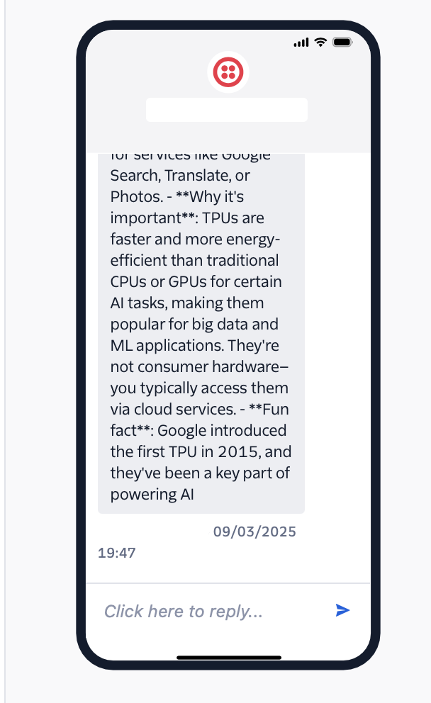

# SMS Bridge with Grok AI
Designed to provide Grok Chat for Starlink Direct to Cell service (T-Mobile, September 2025)
Related: [X post by anemll](https://x.com/anemll/status/1963318984331465018)

A Flask application that bridges SMS messages with xAI's Grok model using Twilio, enabling AI-powered conversations via satellite SMS connectivity.

## Primary Use Case: Starlink Direct to Cell

This SMS Bridge enables **satellite-based SMS access to Grok AI** for users with Starlink Direct to Cell service through T-Mobile. Users can send SMS messages from anywhere with satellite connectivity and receive AI-powered responses, making advanced AI capabilities available even in the most remote locations without traditional cellular or internet infrastructure.

### Key Benefits:
- 🌍 **Global Coverage**: Access Grok AI from anywhere with Starlink Direct to Cell
- 📡 **Satellite Connectivity**: No traditional cellular or internet required
- 🤖 **AI-Powered Responses**: Full Grok AI capabilities via simple SMS
- 🔄 **Bidirectional Communication**: Send questions, receive detailed AI responses
- 📅 **Future-Ready**: Designed for T-Mobile's September 2025 rollout

<p align="center"></p>


## Features

- Receive SMS messages via Twilio webhook
- Process messages through Grok AI (xAI)
- Send AI-generated responses back via SMS
- Environment-based configuration
- Error handling and message length limits
- **Comprehensive logging** of all SMS and API interactions
- **Real-time log monitoring** and web-based log viewer
- **Performance metrics** (API response times, token usage)
- **System status dashboard** for monitoring

## Setup

### 1. Environment Variables

Copy `.env` and fill in your credentials:

```bash
# Twilio Configuration
TWILIO_SID=your_twilio_sid_here
TWILIO_AUTH_TOKEN=your_twilio_auth_token_here
TWILIO_PHONE=your_twilio_phone_number_here

# xAI (Grok) API Configuration
XAI_API_KEY=your_xai_api_key_here
```

### 2. Install Dependencies

Create a virtual environment (once):

```bash
python3 -m venv venv
```

```bash
# Activate virtual environment
source venv/bin/activate

# Install packages (already done)
pip install flask openai twilio python-dotenv
```

### 3. Run the Application

```bash
python app.py
```

The app will run on `http://0.0.0.0:5001` (accessible from your local network)

## Twilio Webhook Configuration

1. Go to your Twilio Console
2. Navigate to Phone Numbers → Manage → Active numbers
3. Click on your Twilio number
4. Set the webhook URL for incoming messages to the root path:
   ```
   https://your-domain.com/
   ```
   (Twilio requires the webhook at the root path for this setup)

## API Endpoints

- `GET /` - Home page with links to logs and status
- `GET /logs` - View recent application logs
- `GET /status` - System configuration and status
- `POST /` - Twilio webhook endpoint for incoming SMS

## Message Flow

1. User sends SMS to your Twilio number
2. Twilio sends webhook to `/` (root) endpoint
3. App processes message through Grok AI
4. AI response is sent back to user via Twilio
5. Webhook is acknowledged with TwiML response

## Configuration Options

- **Model**: Change `grok-4` to `grok-3-mini` for cost savings
- **Max Tokens**: Adjust `max_tokens` for response length
- **Temperature**: Modify `temperature` for creativity (0.0-1.0)

## Logging & Monitoring

### Log Files
- **`sms_bridge.log`** - Main application log file
- **Console output** - Real-time logs in terminal

### Log Content
- 📱 Incoming SMS details (sender, message, timestamp)
- 🤖 xAI API calls (request, response, duration, tokens)
- 📤 Twilio SMS sending (success/failure, duration, SID)
- ⚠️ Warnings and errors with full details
- 🏁 Complete webhook processing time

### Monitoring Tools
1. **Web Interface:**
   - Visit `/logs` to view recent logs
   - Visit `/status` for system configuration

2. **Web Interface Testing:**
   - Visit `/test` to test SMS webhook from browser
   
3. **Command Line Testing:**
   ```bash
   curl -X POST http://localhost:5001/ \
     -d 'Body=Hello from curl test' \
     -d 'From=+15551234567' \
     -d 'To=YOUR_TWILIO_NUMBER'
   ```

4. **Manual Log Viewing:**
   ```bash
   tail -f sms_bridge.log
   ```

## Testing Locally

For local testing, you can use tools like:
- ngrok (to expose local server to internet)
- Twilio CLI for testing webhooks
- Postman for API testing

### Running Behind NAT (Port Forwarding 5001)

If your server is behind a home/office router (NAT) and you want Twilio to reach it directly without a tunneling service:

1. Ensure the app listens on all interfaces. This app binds to `0.0.0.0:5001` by default.
2. Find your machine's LAN IP (e.g., `192.168.1.50`). On macOS:
   ```bash
   ipconfig getifaddr en0 || ipconfig getifaddr en1
   ```
3. In your router, create a port-forward rule:
   - External port: `5001` (TCP)
   - Forward to LAN IP: your machine's IP
   - Internal port: `5001` (TCP)
4. Allow inbound TCP 5001 on your host firewall (macOS may prompt to allow Python incoming connections on first run).
5. Verify from an external network (cellular):
   ```bash
   curl http://YOUR_PUBLIC_IP:5001/status
   ```
6. Set your Twilio webhook to:
   ```
   http://YOUR_PUBLIC_IP:5001/
   ```
   - Optional: use a Dynamic DNS hostname (e.g., `yourname.ddns.net`) instead of the public IP.
7. Recommended HTTPS: Place a reverse proxy (Caddy/Nginx) on your router/edge or server to terminate TLS on `:443` and proxy to `http://localhost:5001`.

Minimal Caddy example on the server (auto TLS with Let's Encrypt):
```bash
# Caddyfile
your-domain.example {
  reverse_proxy 127.0.0.1:5001
}
```
Then set Twilio webhook to:
```
https://your-domain.example/
```

Notes:
- Some ISPs use CGNAT or block inbound ports; in that case, prefer a tunnel (e.g., ngrok) or deploy to a VPS.
- NAT loopback may not work from inside your LAN; test from outside (e.g., cellular).
